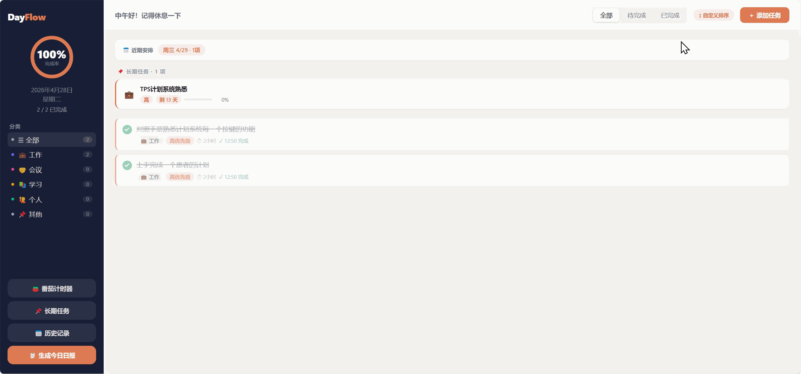

<div align="center">

# DayFlow

**每日任务记录及日报自动生成助手，本地浏览器可以直接打开使用！**

[](LICENSE)
[](https://developer.mozilla.org/en-US/docs/Web/Progressive_web_apps)
[](DayFlow.html)
[](DayFlow.html)

一个 HTML 文件，拖进浏览器就能用。<br>
没有 npm，没有构建，没有服务器，数据只存在你自己的设备上。

[在线体验 →](https://medicialcoder.github.io/DayFlow/DayFlow.html)

</div>

---

## 截图



---

## ✨ 功能

**📋 今日任务**
- 添加任务，设置优先级（高 / 中 / 低）、分类、预计时长、备注
- 完成、编辑、删除；支持拖拽手动调整顺序
- 可将任务安排到未来某天
- 按状态（待完成 / 已完成）和分类过滤

**📌 长期任务**
- 设置起止日期，手动更新进度（0–100%）
- 首页直接展示今天在周期内的长期任务及剩余天数

**📅 历史记录**
- 查看任意历史日期的任务列表
- 一键导出当天结构化工作日报（`.txt`）

**🍅 番茄计时器**
- 25 / 15 / 5 分钟三种模式
- 点击任务卡片上的 🍅 直接关联任务并开始计时
- 完成时音效提醒，记录当日番茄数

**📊 其他**
- 侧栏完成率进度环，实时更新
- 近期 14 天有任务的日期快速入口
- 一键生成工作日报，支持复制或下载

---

## 🚀 快速开始

> 需要通过 HTTP 服务器访问，不能直接双击 `file://`（Service Worker 限制）

```bash
# Python（推荐）
python -m http.server 8080
# 访问 http://localhost:8080/DayFlow.html
```

```bash
# Node.js
npx serve .
```

**Windows 用户**：直接双击 `启动DayFlow.bat`（需已安装 Python 3）

---

## 📱 安装为 App（PWA）

通过 HTTPS 访问时，浏览器会提示安装，安装后可全屏独立运行、离线使用：

| 平台 | 操作 |
|------|------|
| Android Chrome | 地址栏右侧「安装」图标 → 添加到主屏幕 |
| iOS Safari | 底部分享按钮 → 添加到主屏幕 |
| Chrome / Edge 桌面版 | 地址栏右侧「安装」图标 |

---

## 📁 文件结构

```
DayFlow.html      全部逻辑（HTML + CSS + JS，单文件）
sw.js             Service Worker，负责离线缓存
manifest.json     PWA 清单（名称、图标、显示模式）
icon.svg          应用图标
启动DayFlow.bat   Windows 快速启动脚本
```

---

## 🔧 技术栈

纯原生，无任何第三方依赖：

| 技术 | 用途 |
|------|------|
| HTML / CSS / JavaScript | 全部应用逻辑 |
| localStorage | 本地数据持久化 |
| Service Worker | 离线缓存 |
| Web App Manifest | PWA 安装支持 |
| HTML5 Drag and Drop API | 任务拖拽排序 |
| Web Audio API | 番茄计时器提示音 |

---

## 🔒 数据与隐私

所有数据仅保存在本地浏览器的 `localStorage` 中，**不经过任何服务器**。  
清除浏览器数据会丢失记录，建议定期使用「生成日报 → 导出」手动备份。

---

## License

[MIT](LICENSE)
